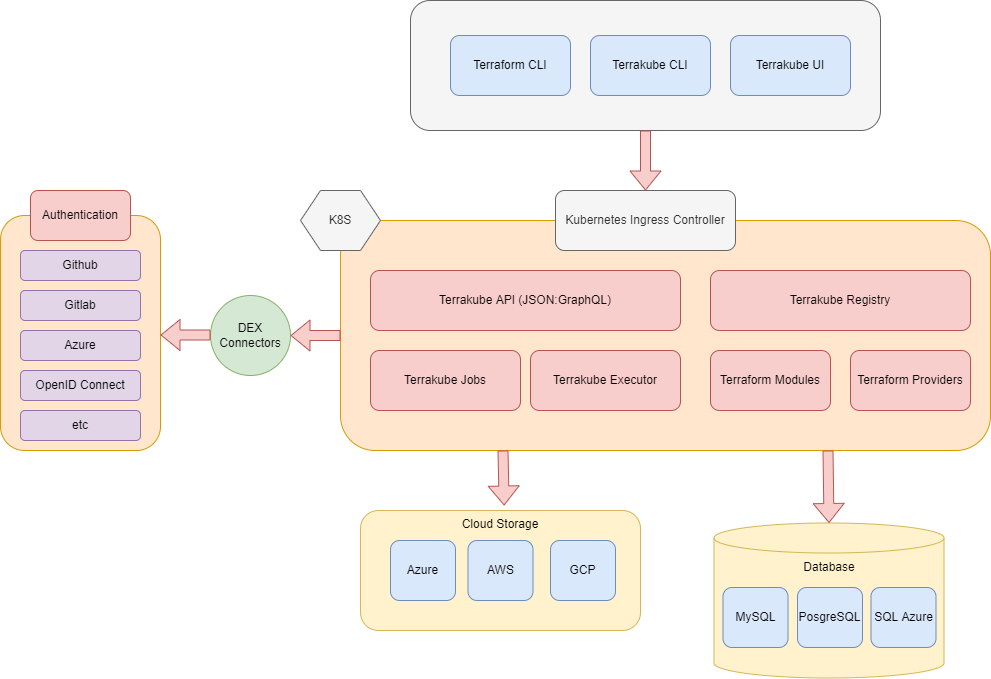

# Architecture

This is the high level architecture of the platform

Component descriptions:

* Terrakube API:
  * Expose a JSON:API or GraphQL API providing endpoints to handle:
    * Organizations.
    * Workspace API with the following support:
      * Terraform state history
      * Terraform output history
      * Terraform Variables (public/secrets)
      * Environment Variables (public/secrets)
      * Cron like support to schedule the jobs execution programmatically
    * Job.
      * Custom terraform flows based on Terrakube Configuration Language
    * Modules
    * Providers
    * Teams
    * Teamplate
* Terrakube Jobs:
  * Automatic process that check for any pending job operations in any workspace to trigger a custom logic flow based on Terrakube Configuration Language
* Terrakube Executor:
  * Service that executes the Terrakube job operations written in Terrakube Configuration Language, handle the terraform state and outputs using cloud storage providers like Azure Storage Account
* Terrakube Open Registry:
  * This component allows to expose an open source private repository protected by Dex that you can use to handle your company private terraform modules or providers.
* Cloud Storage:
  * Cloud storage to handle terraform state, outputs and terraform modules used by terraform CLI
* RDBMS:
  * The platform can be used with any database supported by the Liquibase project.
* Security:
  * All authentication and authorization is handle using [Dex](https://dexidp.io/).
* Terrakube CLI:
  * Go based CLI that can communicate with the Terrakube API and execute operation for organizations, workspaces, jobs, templates, modules or providers
* Terrakube UI:
  * React based frontend to handle all Terrakube Operations.


Terrakube can installed in any kuberentes cluster using any cloud provider. We provide a Helm Chart that can be found in the following [link](https://github.com/AzBuilder/terrakube-helm-chart).

