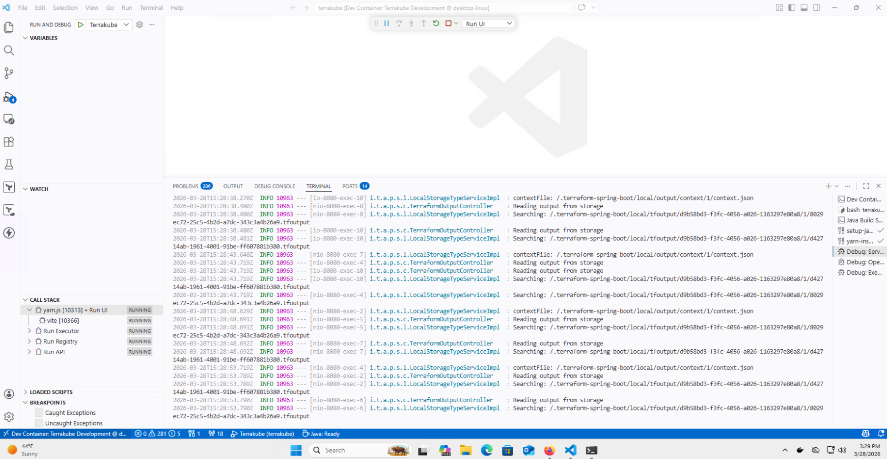

# Dev Container

This page contains the configuration for a development container that provides a consistent environment for working with Terrakube.

The devcontainer includes all the necessary tools and dependencies to develop both the Java backend, TypeScript frontend components and includes terraform CLI.


The below was tested using Ubuntu-based distribution and Windows 11 with Firefox browser.


### Features

* Java 25 (Liberica)
* Maven 3.9.9
* Node.js 22.x with Yarn
* VS Code extensions for Java, JavaScript/TypeScript

### Getting Started

#### Prerequisites

* [Visual Studio Code](https://code.visualstudio.com/)
* [VS Code Remote - Containers extension](https://marketplace.visualstudio.com/items?itemName=ms-vscode-remote.remote-containers)

**Local Development Domains**

To use the devcontainer we need to setup the following domains in our local computer:

```
terrakube.platform.local
terrakube-api.platform.local
terrakube-registry.platform.local
terrakube-dex.platform.local
```

**HTTPS Local Certificates**

Install [mkcert](https://github.com/FiloSottile/mkcert#installation) to generate the local certificates.

To generate local CA certificate execute the following:

```
mkcert -install
Created a new local CA 💥
The local CA is now installed in the system trust store! ⚡️
The local CA is now installed in the Firefox trust store (requires browser restart)! 🦊
```

**Local DNS entries**

Update the /etc/hosts or C:\Windows\System32\drivers\etc\hosts file adding the following entries:

```
127.0.0.1 terrakube.platform.local
127.0.0.1 terrakube-api.platform.local
127.0.0.1 terrakube-registry.platform.local
127.0.0.1 terrakube-dex.platform.local
```

#### Opening the Project in a Dev Container

*   Clone the Terrakube repository and run the project:

    ```
    git clone https://github.com/AzBuilder/terrakube.git
    cd terrakube/.devcontainer
    mkcert -key-file key.pem -cert-file cert.pem platform.local *.platform.local
    CAROOT=$(mkcert -CAROOT)/rootCA.pem
    cp $CAROOT rootCA.pem
    cd ..
    code .
    ```

1. When prompted to "Reopen in Container", click "Reopen in Container". Alternatively, you can:
   * Press F1 or Ctrl+Shift+P
   * Type "Remote-Containers: Reopen in Container" and press Enter
2. Wait for the container to build and start. This may take a few minutes the first time.
3. Start all Terrakube component
4. Terrakube should be availabe with the following url `https://terrakube.platform.local` using `admin@example.com` with password `admin`

### Windows devcontainer

Sometimes in windows the `postCreateCommand` fails because of how windows manage the new lines characters

<figure><figcaption></figcaption></figure>

To fix this it is required to open a terminal in VS Code and run the following:

```bash
sed -i 's/\r$//' ./scripts/setupDevelopmentEnvironment.sh
bash ./scripts/setupDevelopmentEnvironment.sh
```

### Running Terrakube

<figure><figcaption></figcaption></figure>

<figure><figcaption></figcaption></figure>

### Ports

The devcontainer forwards the following ports:

* 8080: Terrakube API
* 8075: Terrakube Registry
* 8090: Terrakube Executor
* 3000: Terrakube UI
* 80/443: Traefik Gateway

### Customization

You can customize the devcontainer by modifying:

* `.devcontainer/devcontainer.json`: VS Code settings and extensions
* `.devcontainer/Dockerfile`: Container image configuration
