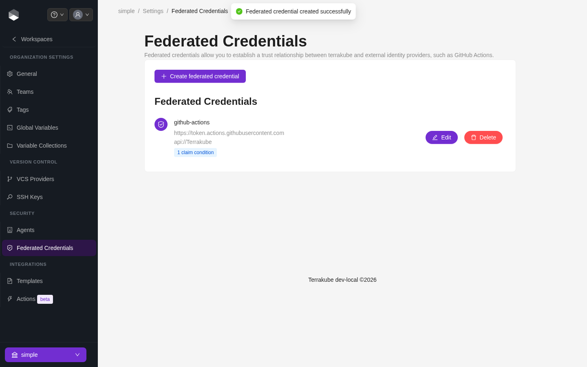
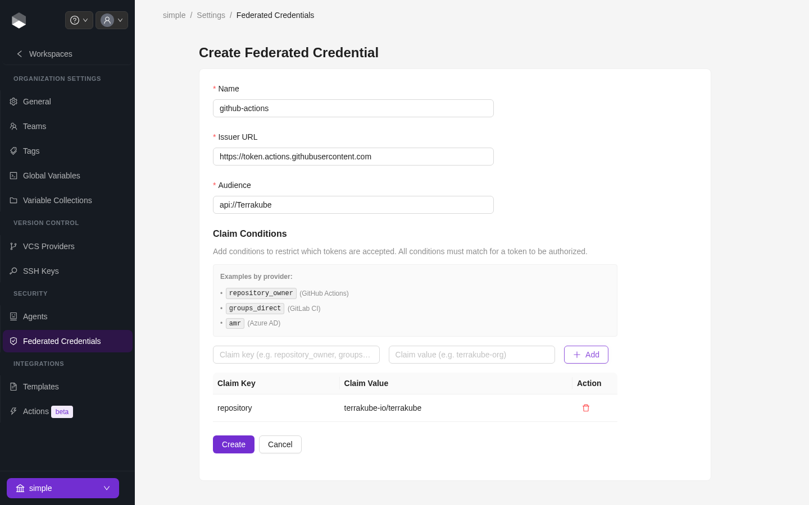

# Federated Identity

Federated identity lets an external OIDC issuer — most commonly GitHub Actions — call the Terrakube API and CLI directly, using a short-lived token minted by that provider. This replaces storing a long-lived Personal Access Token or Team Token as a CI/CD secret: the pipeline requests an OIDC token from its own provider at run time, and Terrakube trusts it because you've registered that issuer ahead of time.


Federated credentials are managed from an organization's **Settings > Federated Credentials** tab, but the underlying trust configuration is instance-wide, and only a **superuser** can create, edit, or delete it. Organization admins who aren't superusers will see the tab but can't manage entries.


<figure><figcaption>
Federated Credentials, showing one credential with a claim condition
</figcaption></figure>

### How it works

1. A superuser registers a federated credential with a **name**, the OIDC **issuer URL** (e.g. `https://token.actions.githubusercontent.com` for GitHub Actions), and the expected **audience** (e.g. `api://Terrakube`).
2. A **team** is created in Terrakube whose name exactly matches the federated credential's name. Permissions for federated callers come entirely from this team's assignments — there's no separate permission model for federated identity.
3. When a request arrives with a JWT whose `iss` and `aud` claims match a registered federated credential, Terrakube verifies the token's signature against that issuer's own JWKS endpoint (instead of your normal Dex/OIDC provider), and treats the caller as a member of the matching team.
4. If the token doesn't match any registered issuer/audience pair, Terrakube falls back to normal authentication (Dex, PAT, or team token).

### Claim conditions

By default, any valid token from a registered issuer/audience is trusted. To narrow that down — for example, to only trust workflows from one specific repository — add one or more **claim conditions** to the federated credential. Every condition must match the token for it to be accepted (logical AND).

Common claims to scope by, per provider:

| Provider        | Example claim key   | Example value             | Restricts to                                |
| ----------------- | --------------------- | ---------------------------- | ---------------------------------------------- |
| GitHub Actions     | `repository`           | `terrakube-io/terrakube`      | A specific repository                          |
| GitHub Actions     | `repository_owner`     | `terrakube-io`                | Any repository under an org/user               |
| GitHub Actions     | `ref`                   | `refs/heads/main`             | A specific branch                              |
| GitHub Actions     | `environment`           | `production`                  | Runs against a specific GitHub environment      |
| GitLab CI            | `groups_direct`         | `terrakube-io`                | Members of a specific GitLab group              |
| Azure AD             | `amr`                   | (issuer-specific)             | A specific authentication method reference      |

### Setting up GitHub Actions as a federated identity provider



#### Register the federated credential

In **Organization Settings > Federated Credentials**, click **Create federated credential** and set:

* **Name**: `github-actions` (this must match the team name in the next step)
* **Issuer URL**: `https://token.actions.githubusercontent.com`
* **Audience**: `api://Terrakube`

<figure><figcaption>
Creating a federated credential with a claim condition
</figcaption></figure>



#### (Optional) Add claim conditions

Add a `repository` claim scoped to `your-org/your-repo` so only workflows in that repository can authenticate.



#### Create a matching team

Create a team named `github-actions` (see [Team Management](team-management.md)) and grant it whatever permissions the pipeline needs — for example, Manage Workspaces on the relevant project.



#### Request an OIDC token in the workflow

Grant the job `id-token: write` permission, request a token with `audience: api://Terrakube`, and pass it as a bearer token to the Terrakube API or CLI instead of a stored PAT.




This is the same trust-relationship pattern used for [dynamic provider credentials](../workspaces/dynamic-provider-credentials/) with AWS, Azure, and GCP — but federated identity authenticates to **Terrakube itself**, while dynamic provider credentials authenticate Terraform to a **cloud provider** from inside a run. The two are configured independently.


A registered federated credential also authenticates requests to the **module/provider registry** (e.g. `terraform init` pulling a private module in CI), using the same issuer/audience/claim rules configured above — there's nothing separate to set up for the registry.
