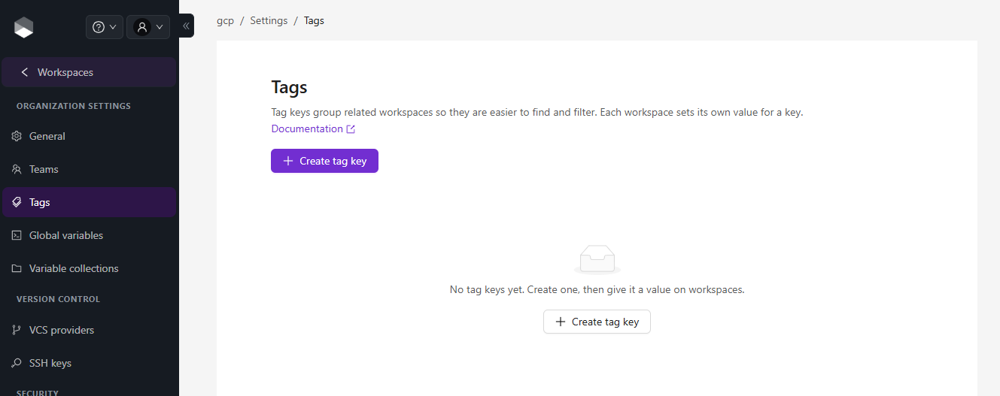
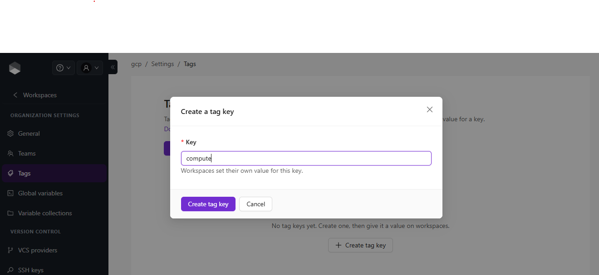
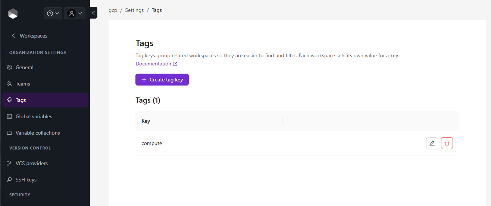
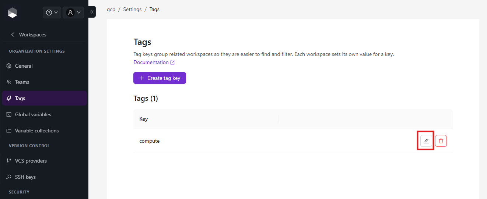
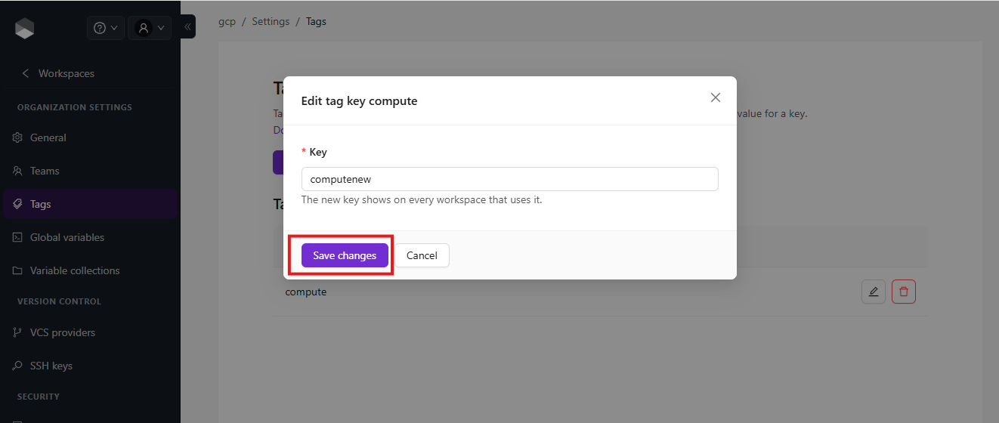
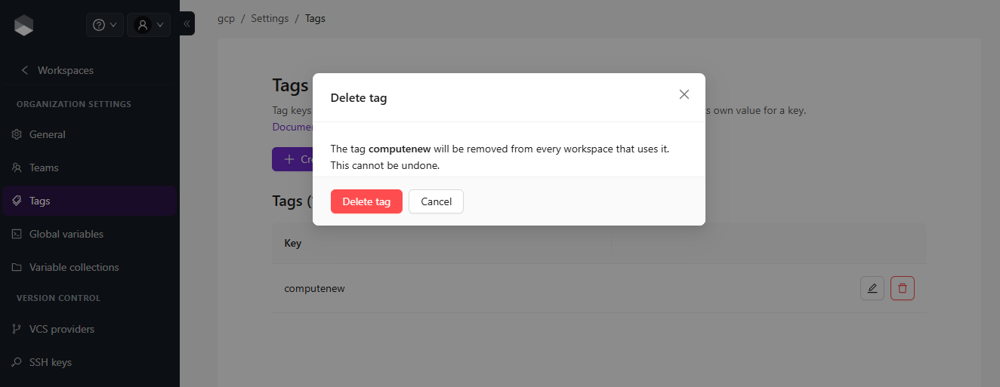

# Tags

You can use tags to categorize, sort, and even filter workspaces based on the tags.

A tag is made of a **key** and an optional **value**. The organization manages the tag keys, and each workspace sets its own value for a key, for example `env = dev` on one workspace and `env = prod` on another. A tag without a value is a key-only tag, which is how tags worked before values were introduced.

You can manage tag keys for the organization in **Organization Settings > Tags**. This section lets you create, rename and delete tag keys. Alternatively, you can add existing keys or create new ones, and set their values, in the [Workspace overview page](../workspaces/overview.md).


A tag key can have up to 128 characters and a tag value up to 256 characters. A workspace holds one value per key.


### Creating a Tag Key

Once you are in the desired organization, open **Organization Settings**, select **Tags** in the left menu and click the **Create tag key** button.

<figure><figcaption></figcaption></figure>

In the **Create a tag key** popup, provide the required values. Use the below table as reference:

| Field | Description         |
| ----- | ------------------- |
| Key   | Unique tag key name |

Finally click the **Create tag key** button in the popup and the tag key will be created.

<figure><figcaption></figcaption></figure>

You will see the new tag key in the list. And now you can use the tag key in the workspaces within the organization, with or without a value.

<figure><figcaption></figcaption></figure>

### Edit a Tag Key

Click the edit (pencil) icon next to the tag key you want to edit.

<figure><figcaption></figcaption></figure>

Change the key and click the **Save changes** button. The new key shows on every workspace that uses it, and the values that workspaces have set for it are kept.

<figure><figcaption></figcaption></figure>

### Delete a Tag Key

Click the delete (trash) icon next to the tag key you want to delete, and then click the **Delete tag** button to confirm the deletion. Please take in consideration the deletion is irreversible and the tag will be removed from all the workspaces using it, together with the values they set for it.

<figure><figcaption></figcaption></figure>
