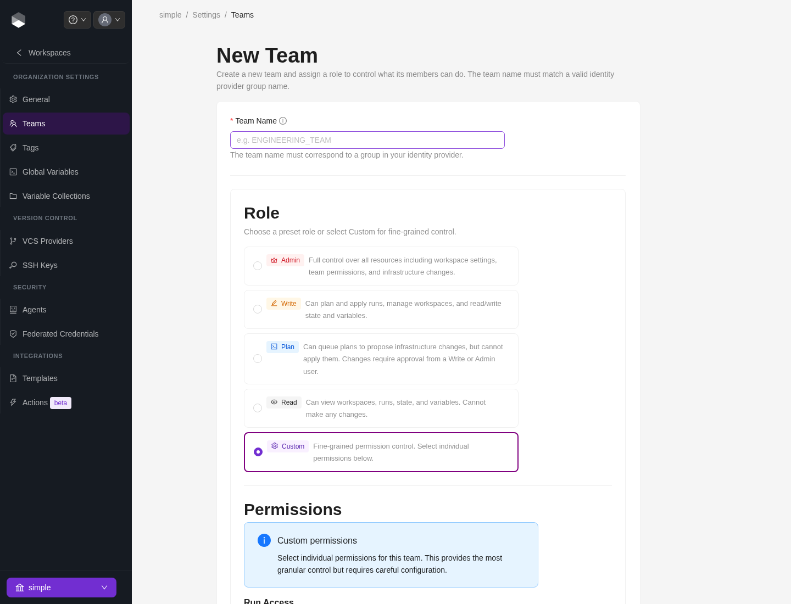
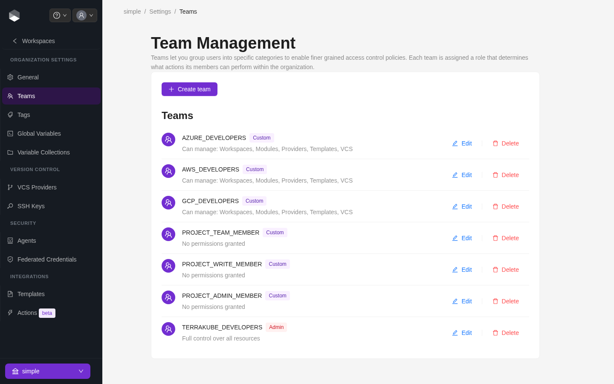

# Team Management

In Terrakube you can define user permissions inside your organization using teams.

### Creating a Team

Once you are in the desired organization, click the **Settings** button and then in the left menu select the **Teams** option.

<figure><figcaption></figcaption></figure>

Click the **Create team** button

<figure><figcaption></figcaption></figure>

In the popup, provide the team name, then choose either a preset **role** or **Custom** permissions.

<table><thead><tr><th width="341">Field</th><th>Description</th></tr></thead><tbody><tr><td>Name</td><td>
Must be a valid group based on the Dex connector you are using to manage users and groups.

For example if you are using Azure Active Directory, you must use a valid Active Directory Group like TERRAKUBE_ADMIN, or if you are using Github the format should be MyGithubOrg:TERRAKUBE_ADMIN
</td></tr></tbody></table>

### Roles

| Role       | Description                                              |
| ----------- | ------------------------------------------------------------ |
| **Admin**   | Full control over all resources in the organization         |
| **Write**   | Can plan, apply runs, and manage workspaces/state             |
| **Plan**    | Can queue plans but cannot apply changes                      |
| **Read**    | Read-only access to workspaces and runs                       |
| **Custom**  | Fine-grained permissions, picked individually below           |


A team's role only sets its baseline at the **organization** level. Additional access can always be layered on top per [project](../projects/team-access.md) or per [workspace](../workspaces/team-access.md) — permissions are additive across organization, project, and workspace, never restrictive.


### Custom permissions

When **Custom** is selected, pick individual permissions:

| Permission              | Description                                                                  |
| -------------------------- | --------------------------------------------------------------------------------- |
| Plan Runs                  | Allow members to queue plan runs                                                  |
| Apply Runs                  | Allow members to approve/apply runs                                              |
| Manage Workspaces           | Allow members to create and administrate all workspaces within the organization    |
| Manage Modules              | Allow members to create and administrate all modules within the organization       |
| Manage Providers            | Allow members to create and administrate all providers within the organization     |
| Manage [Templates](templates/) | Allow members to create and administrate all [templates](templates/) within the organization |
| Manage [Variable Collections](variable-collections.md) | Allow members to create and administrate variable collections within the organization |
| Manage State                | Allow members to see the terraform/tofu state from the UI                          |
| Manage [VCS Settings](../vcs-providers/) & SSH | Allow members to create and administrate all [VCS Providers](../vcs-providers/) and SSH keys within the organization |

<figure><figcaption>
New Team form with the Admin/Write/Plan/Read/Custom role selector
</figcaption></figure>

Finally click the **Create team** button and the team will be created

<figure><figcaption>
Teams list, showing preset (Admin) and Custom roles
</figcaption></figure>

Now all the users inside the team will be able to manage the specific resources within the organization based on the permissions you grantted.

### Edit a Team

Click the **Edit** button next to the team you want to edit

<figure><figcaption></figcaption></figure>

Change the permissions you need and click the **Save team** button

<figure><figcaption></figcaption></figure>

### Delete a Team

Click the **Delete** button next to the team you want to delete, and then click the Yes button to confirm the deletion. Please take in consideration the deletion is irreversible

<figure><figcaption></figcaption></figure>
