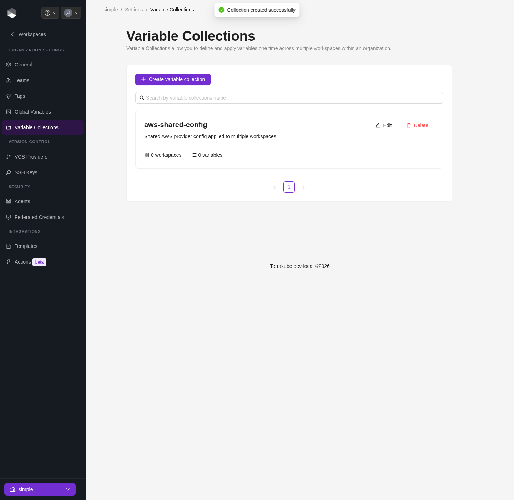
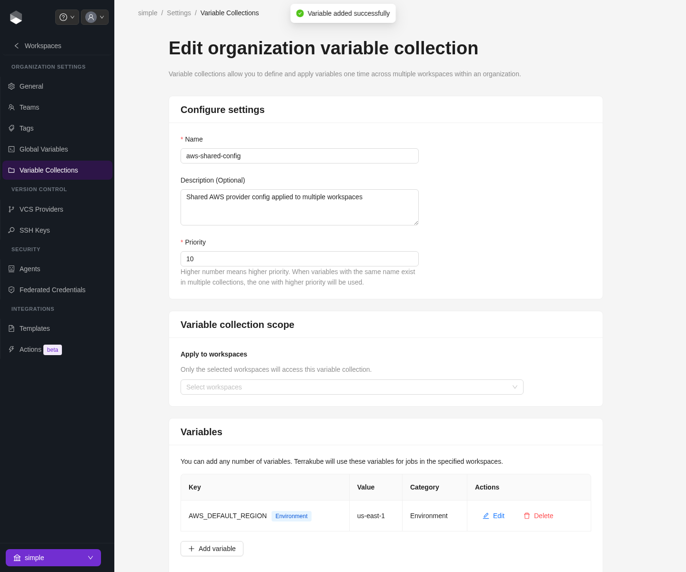

# Variable Collections

A **variable collection** is a named, reusable set of variables at the organization level that you can apply to any number of workspaces — similar to a "variable set" in other Terraform automation tools. Instead of copying the same provider config, tags, or environment variables into every workspace, define them once in a collection and attach it to whichever workspaces need it.

Manage collections from **Organization Settings > Variable Collections**.


Managing collections requires the **Manage Collections** permission. See [Team Management](team-management.md).


<figure><figcaption>
A newly created variable collection, before any variables are added
</figcaption></figure>

### Creating a collection

1. Click **New collection**, give it a **name**, an optional **description**, and a **priority** (see [Resolution order](#resolution-order) below).
2. Optionally select workspaces under **Apply to workspaces** to attach the collection immediately — you can also attach or remove workspaces later.
3. Save the collection, then add variables to it.

### Variables in a collection

Each item in a collection has the same shape as a regular workspace variable:

| Field       | Description                                                        |
| ----------- | -------------------------------------------------------------------- |
| Key         | Variable name                                                        |
| Value       | Variable value                                                       |
| Category    | `Terraform` (passed as a `-var`) or `Environment` (an env var for the run) |
| Sensitive   | Hides the value after saving; cannot be retrieved once set           |
| HCL         | Whether the value should be parsed as HCL instead of a plain string  |
| Description | Optional note                                                        |

<figure><figcaption>
A collection with one environment variable added
</figcaption></figure>

### Attaching a collection to workspaces

On the collection's edit page, the **Apply to workspaces** field under **Variable collection scope** picks which workspaces the collection applies to. Only the workspaces selected there receive the collection's variables — removing a workspace from this list detaches the collection without deleting the collection or its variables.

### Resolution order

When a job runs, variables are resolved in this order, with earlier sources winning on key conflicts:

1. **Workspace variables** — set directly on the workspace
2. **Organization global variables** — see [Global Variables](global-variables.md)
3. **Variable collections** — applied to the workspace, highest **priority** first; if two collections both define the same key, the one with the higher priority number wins


A variable collection can never override a workspace-level or global variable with the same key — it only fills in keys that aren't already set. Use priority to control conflicts **between** collections, not between a collection and the workspace itself.

