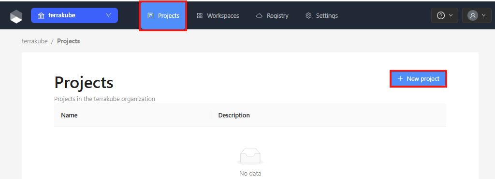
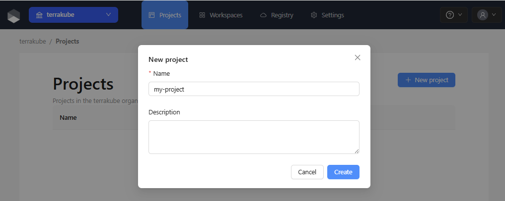
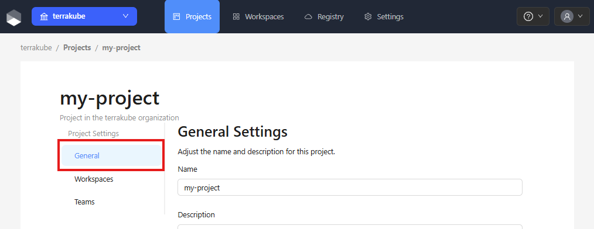
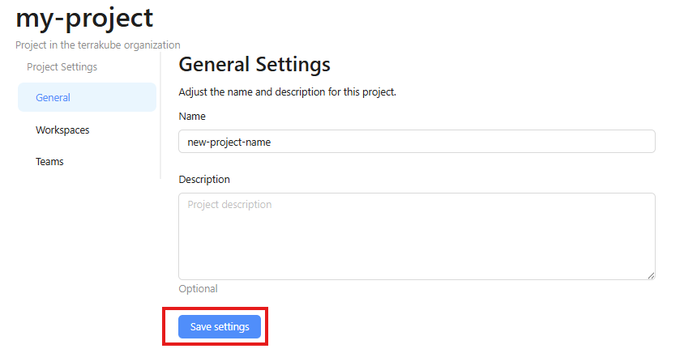
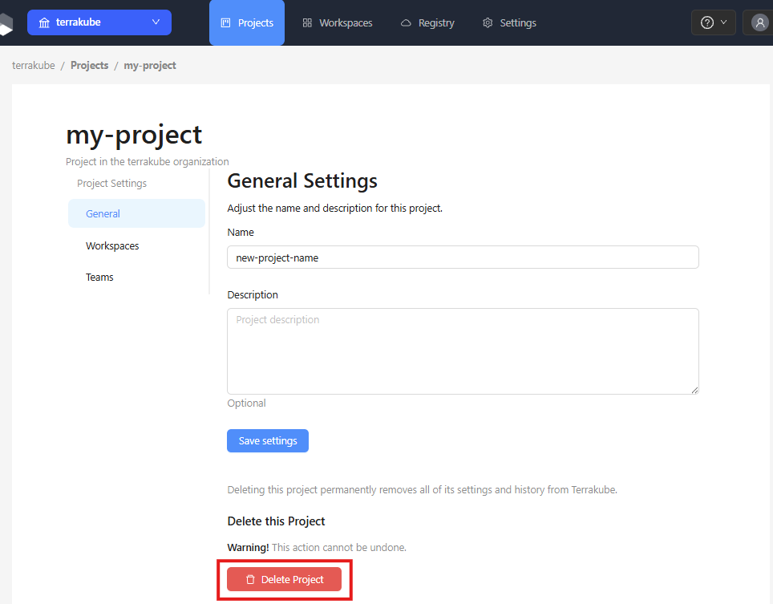

# Creating Projects

Projects are logical groupings of workspaces within an organization. You can create multiple projects to reflect your team structure, environments, or application boundaries.


You need the **Manage Workspaces** permission at the organization level to create, edit, or delete projects.


### Creating a Project

Click **Projects** in the main menu and then Click the **New project** button.

<figure><figcaption></figcaption></figure>

Enter a name for the project and click **Create project**.

<figure><figcaption></figcaption></figure>

The project will appear in your projects list. Before assigning workspaces, configure team access to grant the necessary permissions.


Only organization members with organization-level Write permissions or higher can manage workspaces. To delegate workspace management to other teams, configure project-level team access first. See [team-access.md](team-access.md "mention") for details.


### Editing a Project

Open the project you want to edit by clicking its name in the projects list. Navigate to the ** ** tab on the project detail page.

<figure><figcaption></figcaption></figure>

Update the project name and click **Save**.

<figure><figcaption></figcaption></figure>

### Deleting a Project

Open the project you want to delete and navigate to the **General** tab. Click the **Delete project** button.

<figure><figcaption></figcaption></figure>


A project cannot be deleted while it still has workspaces assigned to it. Remove or reassign all workspaces before deleting the project.

