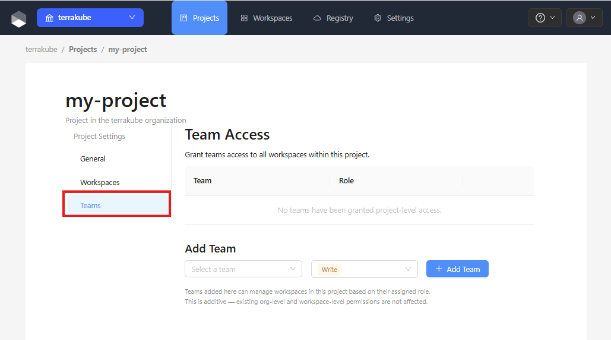
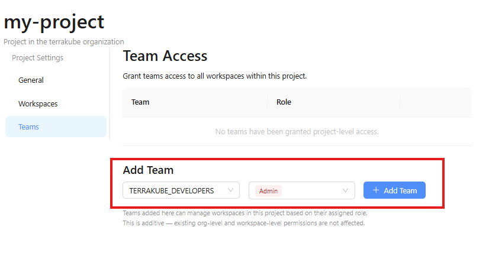
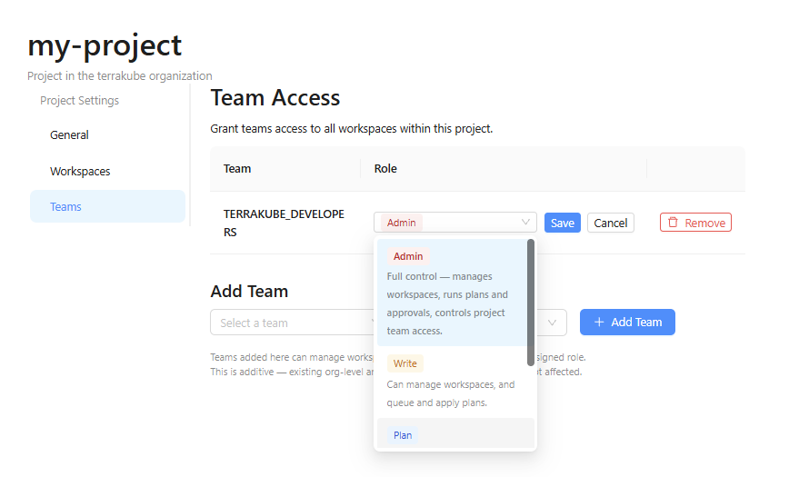
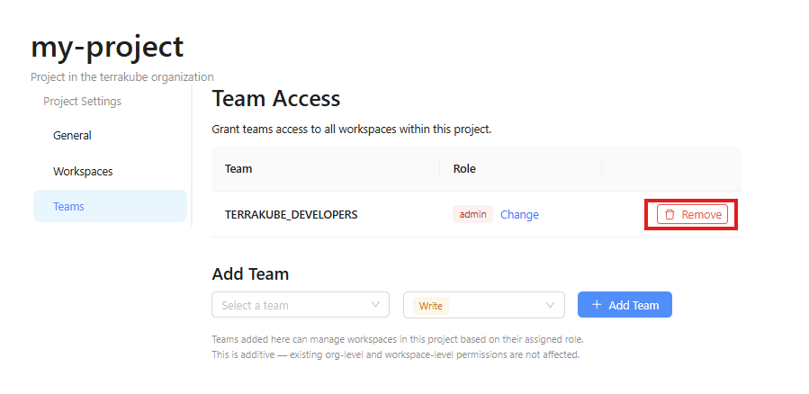

# Team Access

Project-level team access lets you grant a team a specific role that applies to all workspaces within the project. This avoids having to configure permissions on each workspace individually.

### Permission Hierarchy

Permissions follow a three-tier hierarchy. The most permissive level takes precedence:

1. **Organization** — organization-level team permissions (Manage Workspaces, etc.)
2. **Project** — project-level role assigned on the Teams tab
3. **Workspace** — future workspace-level overrides


Workspaces that are not assigned to any project remain visible to all members of the organization (backward-compatible behavior).


### Project Roles

| Role  | Manage Project | Manage Workspace | Create Workspace | Plan Job | Approve Job |
| ----- | :------------: | :--------------: | :--------------: | :------: | :---------: |
| Admin | ✅             | ✅               | ✅               | ✅       | ✅          |
| Write | ❌             | ✅               | ✅               | ✅       | ✅          |
| Plan  | ❌             | ❌               | ❌               | ✅       | ❌          |
| Read  | ❌             | ❌               | ❌               | ❌       | ❌          |

### Adding a Team

Open the project and click the **Teams** tab.

<figure><figcaption></figcaption></figure>

Select a team from the dropdown, choose a role, and click **Add Team**.

<figure><figcaption></figcaption></figure>

The team will appear in the access table and the selected role will be applied to all workspaces in the project.

### Changing a Team's Role

In the Team Access table, click the **Change** button on the row of the team you want to update. Select the new role from the dropdown.

<figure><figcaption></figcaption></figure>


Hover over a role tag in the table to see a description of what the role allows.


### Removing a Team

Click the **Remove** button on the team's row in the Team Access table to revoke the team's access to the project.

<figure><figcaption></figcaption></figure>
