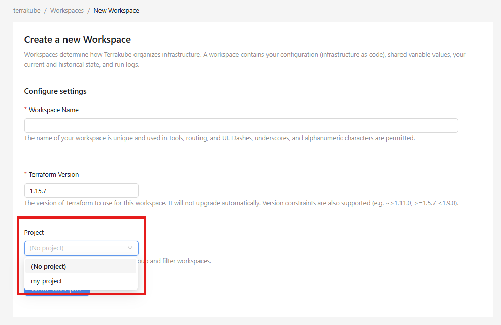
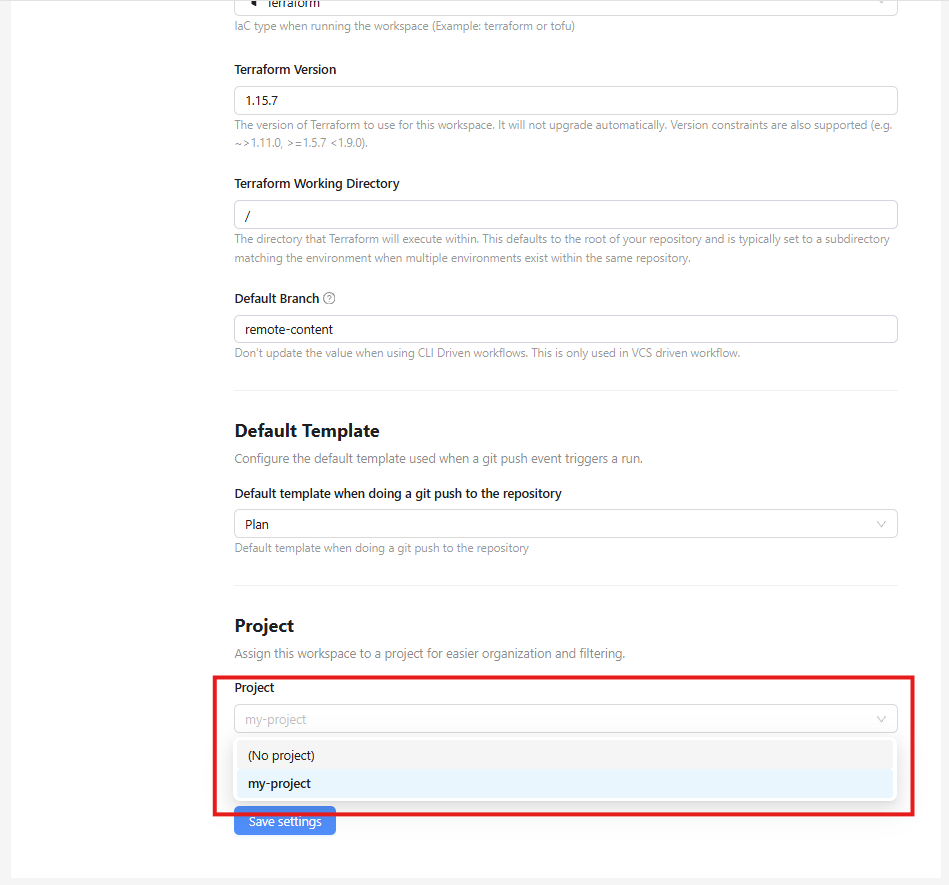
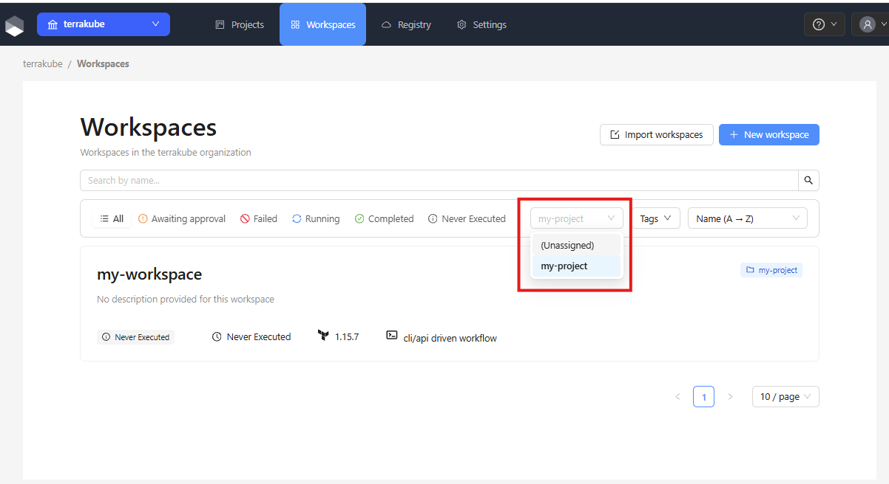
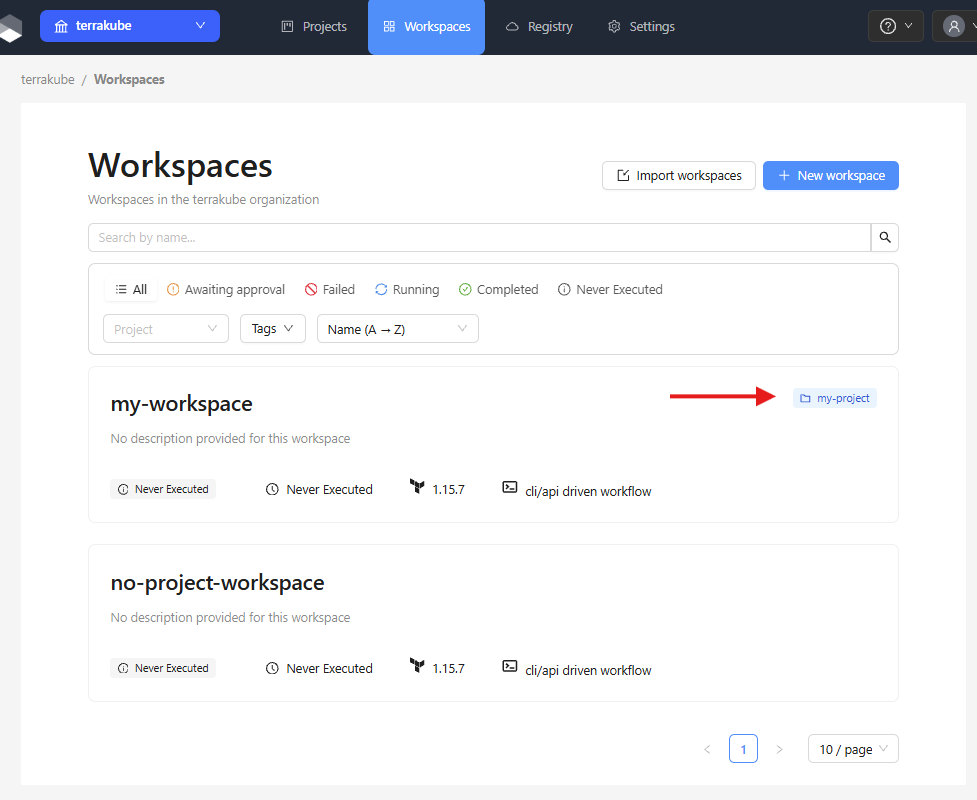

# Workspace Assignment

Workspaces can be optionally assigned to a project. Assigning a workspace to a project lets you apply project-level team permissions and keeps related workspaces organized together.

### Assigning a Project when Creating a Workspace

When going through the workspace creation wizard, select a project from the **Project** dropdown. This field is optional — selecting **(No project)** leaves the workspace unassigned.

<figure><figcaption></figcaption></figure>

### Changing a Workspace's Project

To move a workspace to a different project or remove its project assignment, open the workspace and go to its **Settings** page. Find the **Project** field and select a new project or clear the selection, then save.

<figure><figcaption></figcaption></figure>


Moving a workspace between projects requires the **Manage Workspaces** permission at the organization level, regardless of your project-level role.


### Filtering Workspaces by Project

On the workspaces list page, use the **Project** dropdown filter to show only workspaces belonging to a specific project. Select **Unassigned** to show workspaces that have not been assigned to any project.

<figure><figcaption></figcaption></figure>

### Project Badge on Workspace Cards

Each workspace card in the list displays the name of its assigned project as a badge. Workspaces without a project assignment show no badge.

<figure><figcaption></figcaption></figure>
