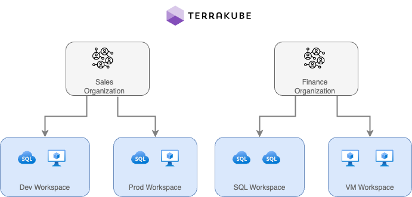

# Workspaces

When working with Terraform at Enterprise level, you need to organize your infrastructure in different collections. Terrakube manages infrastructure collections with **workspaces**. A workspace contains everything Terraform needs to manage a given collection of infrastructure, so you can easily organize all your resources based in your requirements.

For example, you can create a workspace for dev environment and a different workspace for production. Or you can separate your workspaces based in your resource types, so you can create a workspace for all your SQL Databases and anothers workspace for all your VMS.

<figure><figcaption></figcaption></figure>

You can create unlimited workspaces inside each Terrakube Organization. In this section:


[creating-workspaces.md](creating-workspaces.md)



[terraform-state.md](terraform-state.md)



[variables.md](variables.md)



[workspace-scheduler.md](workspace-scheduler.md)


