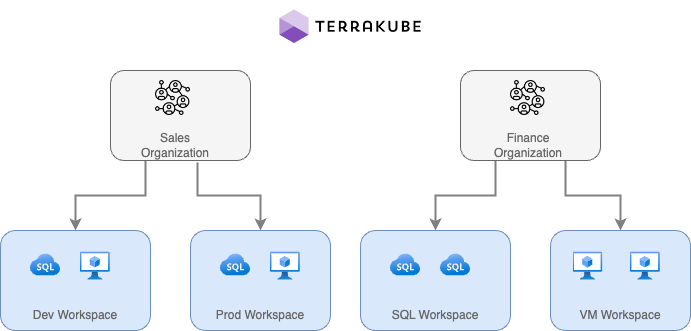

# Workspaces

When working with Terraform at Enterprise level, you need to organize your infrastructure in different collections. Terrakube manages infrastructure collections with **workspaces**. A workspace contains everything Terraform needs to manage a given collection of infrastructure, so you can easily organize all your resources based in your requirements.

For example, you can create a workspace for dev environment and a different workspace for production. Or you can separate your workspaces based in your resource types, so you can create a workspace for all your SQL Databases and anothers workspace for all your VMS.

<figure><figcaption></figcaption></figure>

You can create unlimited workspaces inside each Terrakube Organization.

### Workspaces list


_Screenshot pending: the Workspaces list in New view, grouped by project._


The **Workspaces** page has two views, toggled in the top right and remembered per browser:

* **New** — a condensed list with click-to-filter tags and project chips, an optional **group by project** mode (each project paginates independently), and a lock indicator per workspace.
* **Legacy** — the original table view.

Use the search box and tag/project filters to narrow a long list; clicking a tag or project chip on any row applies it as a filter directly.

In this section:


[creating-workspaces.md](creating-workspaces.md)



[terraform-state.md](terraform-state.md)



[variables.md](variables.md)



[workspace-scheduler.md](workspace-scheduler.md)


