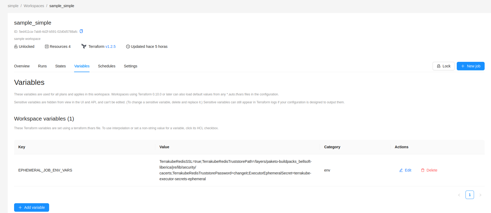

# Creating Workspaces


**Manage Workspaces** permission is required to perform this action, please check [team-management.md](../organizations/team-management.md "mention") for more info.


Click **Workspaces** in the main menu and then click the **New workspace** button

<figure><figcaption></figcaption></figure>

Choose the **Version control workflow**


Terrakube only support the version control flow at the moment. The other workflows will be supported later.


<figure><figcaption></figcaption></figure>
