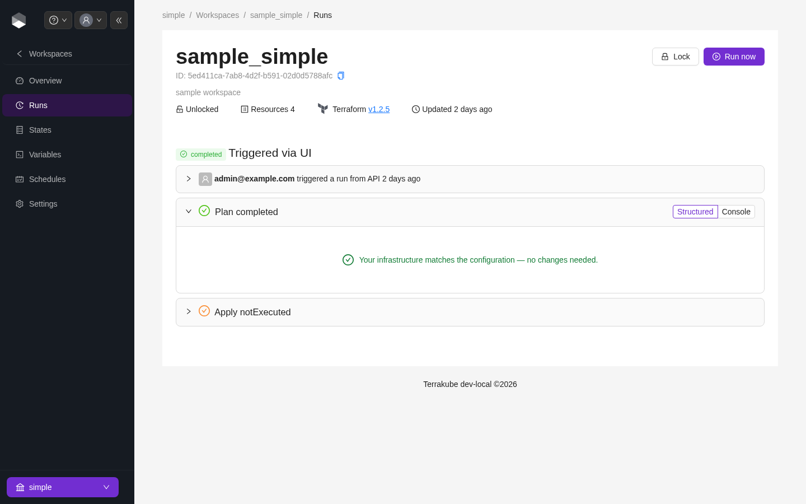

# Job Output

Each plan and apply step in a job's output has a **Structured** / **Console** toggle. **Console** shows the raw Terraform/OpenTofu CLI output; **Structured** renders the same plan or apply as a resource-by-resource change list.

<figure><figcaption>
A plan step with the Structured view selected
</figcaption></figure>

### Structured view

Each resource in the structured view shows:

* An **action** badge — `create`, `update`, `delete`, `replace` (destroy + create), `import`, or `no-op`
* The specific attributes changing, with unchanged attributes collapsed by default (expanded by default for imports, since the point of reviewing an import is usually to check what already matches)
* A provider icon next to the resource address

Use the **filter resources by address** search box and the **operation filter** (multi-select, with a count per operation) to narrow a large plan down to the changes you care about.


Sensitive values are redacted before they leave the executor, in both Structured and Console views — not just hidden client-side.


### Apply-time structured output

During an apply, the structured view updates live, per resource, as Terraform/OpenTofu applies each change — you don't have to wait for the whole apply to finish to see which resources have completed. Once the apply finishes, an **Outputs** section lists the workspace's Terraform outputs, with sensitive outputs redacted the same way as resource attributes.
