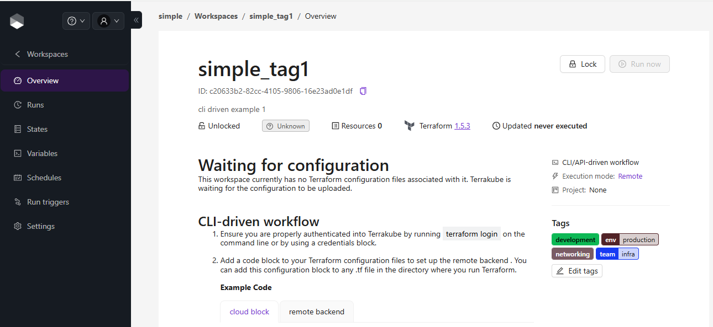
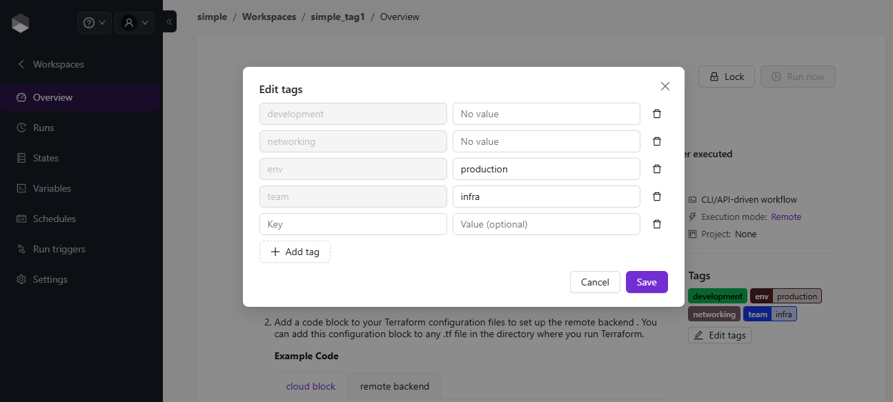

# Overview

The workspace overview page provides you a summary of the current workspace state.

### Managing Workspace Tags

The right panel of the overview page shows the workspace's tags as chips. A key/value tag shows its key and its value, and a key-only tag shows just its key. Hover a chip to see the tag as `key = value`.

<figure><figcaption></figcaption></figure>

If you can manage the workspace, click **Edit tags** to open the tag editor. Each row of the editor is one tag, with a key and a value:

* **Add a tag**: click **Add tag**, then select an existing tag key or type a new key name, and optionally type a value. Leave the value empty to add a key-only tag. A new key name is also added to the organization's [tag keys](../organizations/tags.md).
* **Change a value**: edit the value of an existing row. Clear it to turn the tag into a key-only tag.
* **Remove a tag**: click the delete icon next to the row.

<figure><figcaption></figcaption></figure>

Click **Save** to send the removals, value changes and new tags at once, or **Cancel** to discard them.


A workspace holds one value per key, so the key of a saved tag can't be edited. To use a different key, remove the row and add a new one.


Tags can also be set from the Terraform CLI with the `tags` attribute of the `cloud` block. See [CLI-driven Workflow](cli-driven-workflow.md#selecting-workspaces-with-tags).
