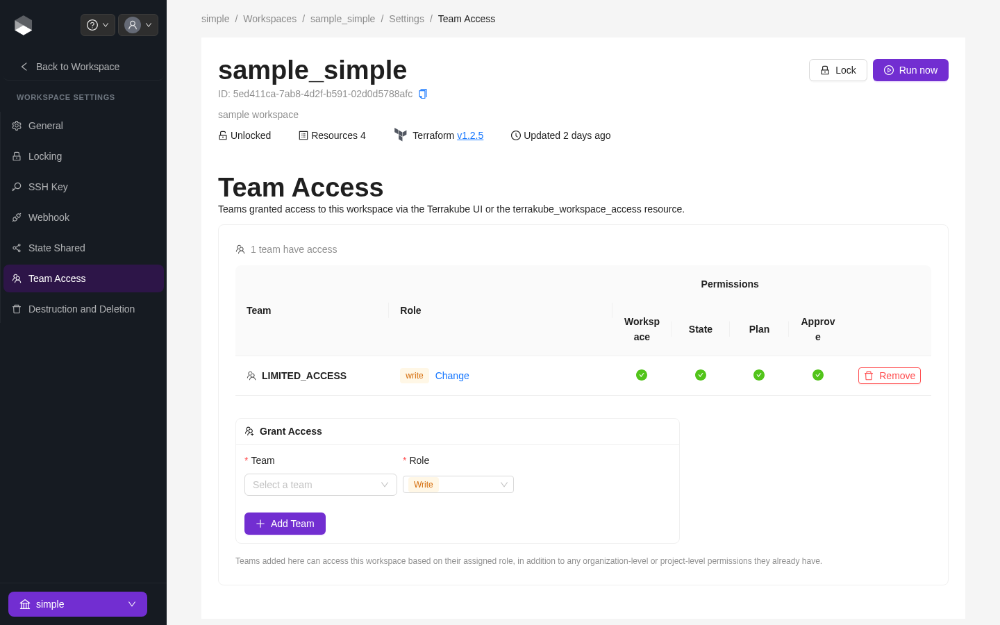

# Team Access

A workspace's **Team Access** tab grants teams access scoped to that single workspace, on top of whatever they already have from [organization](../organizations/team-management.md) or [project](../projects/team-access.md) level permissions. Access is always additive — a role granted here can't take away permissions a team already has at the organization or project level.


Managing workspace team access requires the **Manage Workspace** permission on that workspace (from any level of the hierarchy).


### Roles

| Role      | Description                                            |
| ---------- | ---------------------------------------------------------- |
| **Admin**  | Full control over this workspace                          |
| **Write**  | Can plan, apply runs, and manage this workspace's settings |
| **Plan**   | Can queue plans but cannot apply changes                   |
| **Read**   | Read-only access to this workspace and its runs            |
| **Custom** | Fine-grained permissions, picked individually               |

### Custom permissions

When **Custom** is selected:

| Permission        | Description                                     |
| ------------------- | ---------------------------------------------------- |
| Plan Runs            | Queue plan runs on this workspace                    |
| Apply Runs             | Approve/apply runs on this workspace                 |
| Manage Workspace      | Administrate this workspace's settings                |
| Manage State           | View the terraform/tofu state for this workspace from the UI |

### Adding a team

Open the workspace, go to **Settings > Team Access**, select a team and a role, and click **Add**.

<figure><figcaption>
Team Access tab, with one team granted the Write role
</figcaption></figure>


This tab can also be managed via the `terrakube_workspace_access` resource in the [Terrakube Terraform provider](https://registry.terraform.io/providers/AzBuilder/terrakube), or the [Workspace Access](../terrakube-cli/commands/workspace-access/) CLI commands.

